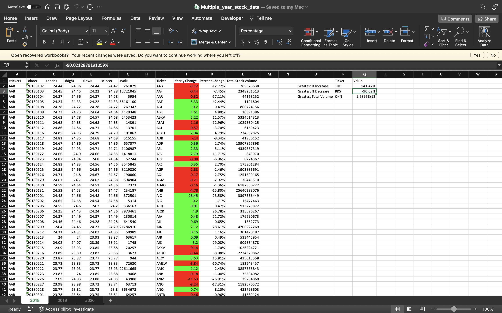
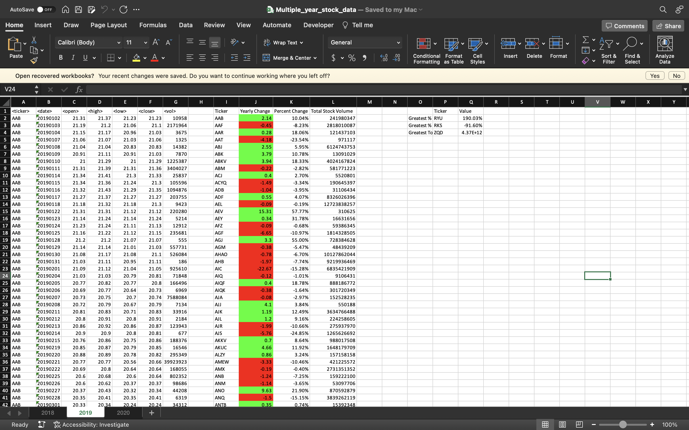
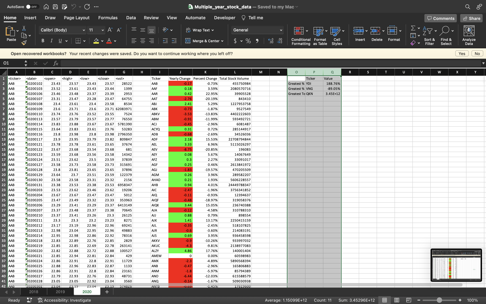

# stock-analysis-vba
This project employs a VBA script that loops through daily stock data to calculate yearly change, percent change, and total trading volume for all stocks included in a data set. It also extracts maximum and minimum percent change and maximum total trading volume for at-a-glance analysis of performance over a one-year period.

Data for multiple years is included in the data set, separated into different tabs. The script performs the stated calculations and extractions on all tabs.

## Procedure
- Create a script that loops through all the stocks for one year and outputs the following information:
  - Ticker symbol
  - Yearly change from the opening price at the beginning of a given year to the closing price at the end of that year
  - The percentage change from the opening price at the beginning of a given year to the closing price at the end of that year.
  - The total stock volume of the stock.

- Add functionality to return the stock with the "Greatest % increase", "Greatest % decrease", and "Greatest total volume".

This VBA script effectively runs on every worksheet (that is, every year) at once. Results are as follows:

